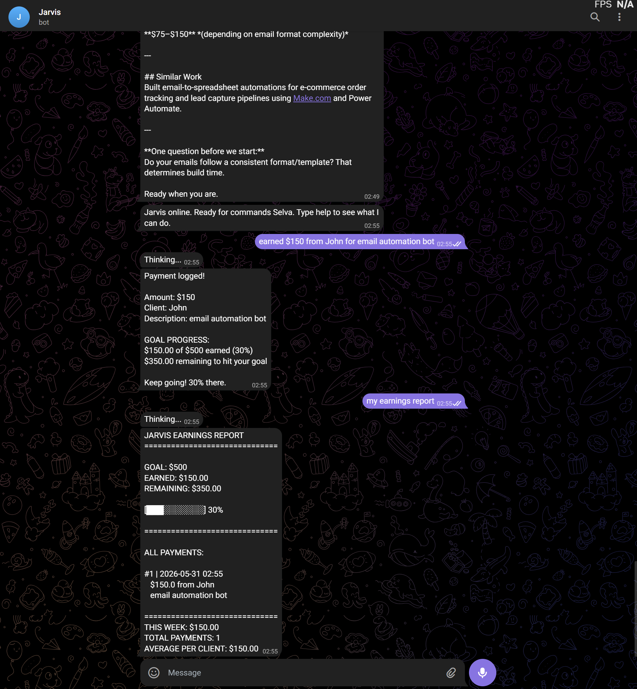

# Jarvis — Personal AI Assistant

A fully functional voice-controlled AI assistant built with Python and Claude AI.
Built from scratch in under 2 weeks with no prior experience.

## What Jarvis Does
- Reads and summarises Gmail inbox daily using Claude AI
- Accepts text and voice commands via Telegram
- Searches the web and summarises results
- Remembers context across sessions
- Scans for freelance job opportunities
- Writes Upwork proposals in seconds
- Tracks earnings toward income goals
- Sends clean morning briefings automatically

## Tech Stack
- Python 3
- Claude AI (Anthropic API)
- Gmail API
- Telegram Bot API
- SerpAPI (web search)
- Faster-Whisper (local voice transcription)

## Modules
| Module | Description |
|--------|-------------|
| gmail_fetch.py | Connects to Gmail and fetches emails |
| summariser.py | Summarises emails using Claude AI |
| jarvis_brain.py | Core Claude AI thinking engine |
| jarvis_commands.py | Command router and handler |
| jarvis_listener.py | Telegram bot listener |
| jarvis_memory.py | Persistent memory system |
| jarvis_search.py | Web search and summarisation |
| jarvis_jobs.py | Freelance job scanner |
| jarvis_earnings.py | Income tracker with goal progress |
| jarvis_voice.py | Local voice transcription |
| jarvis_voice_trigger.py | Voice command pipeline |

## Setup
1. Clone this repo
2. Install dependencies:
   pip install anthropic google-auth google-auth-oauthlib google-api-python-client python-dotenv requests faster-whisper sounddevice soundfile numpy beautifulsoup4 google-search-results
3. Add your API keys to .env file
4. Run: python jarvis_listener.py

## Demo

## Built By
Selva — AI Automation Developer
